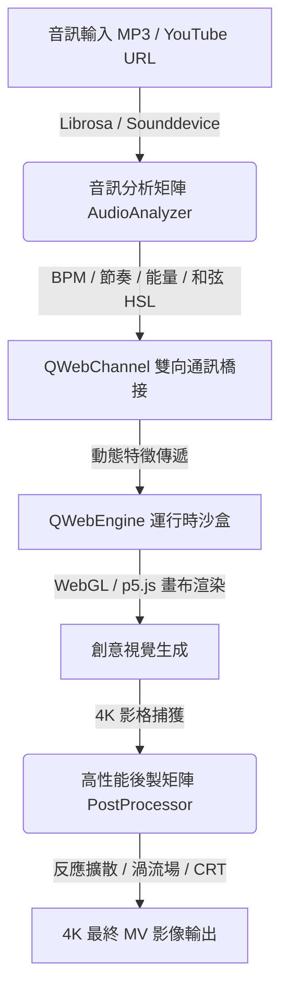
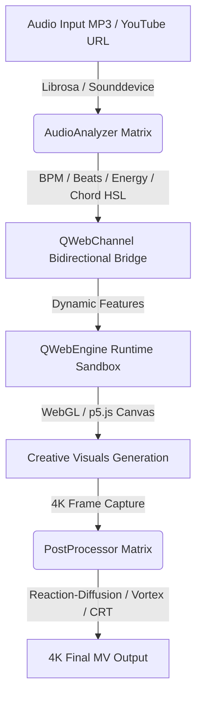

# 4K MV Visual Integration Editor 🎬✨

[](https://github.com/wannaplaymusic/4k-mv-visual-editor)
[](https://python.org)
[](https://www.riverbankcomputing.com/software/pyqt/)
[]()

🌐 **[繁體中文](#-繁體中文) | [English](#-english)**

---

## 🇹🇼 繁體中文

`4K MV Visual Integration Editor` 是一個專為 4K 音樂錄影帶（Music Video）與即時 VJ 演出設計的**混合型高性能音視互動編輯系統**。

本系統結合了 **PyQt6 桌面端應用程式**與 **前端 WebGL / p5.js 渲染畫布**，透過高速二進位級/JSON 雙向橋接（QWebChannel），將後端提取的高維度即時音訊特徵，動態餵給前端視覺模組；同時利用 **OpenCV** 在後端進行工業級 4K 影格後製處理（包括反應擴散、流體渦流場模擬等），為音樂人、VJ 以及多媒體藝術家提供極致震撼的視覺生成平台。

### 🚀 核心架構與功能



*   **🎵 智能音訊分析矩陣 (`audio_analyzer.py` & `audio_stem_separator.py`)**：即時分析並提取 `Sub-bass`、`Bass`、`Mid`、`High` 等子頻段的動態能量比率；支援 4-Stem 神經/物理聲學分軌與 18 大音樂風格本體識別。
*   **🎬 CINEDANCE 鏡頭光學編譯系統 (`cinedance_compiler.py`)**：融合 Higgsfield CINEDANCE 影視級幾何光學編譯，具備鏡頭風險審計 (`ShotRiskAuditor`)、動態 H-FOV/Dolly Zoom、三層景深彈性錨定與三元光學向量求解。
*   **🌀 12 大旗艦 VJ 特效與 PSE 光敏健康防護 (`post_processor.py`)**：包含克拉尼駐波、磁流體刺針、體積焦散、四維環面、全息莫爾、電影級失焦等 12 種音畫濾鏡；全面整合 ITU-R BT.1702 光敏性癲癇 (PSE) 實時防護。
*   **🧠 有機心靈調變與語義軟投影 (`expressive_modulator.py` & `semantic_soft_projector.py`)**：非對稱彈道阻尼濾波（快充慢放）消除頻率生硬感；榮格原型與心靈狀態三級軟投影徹底根除選片死鎖。
*   **🚀 VisualStudio Pro 4K 視覺神經工作站 (`visual_studio.py`)**：獨立進程視覺創作工作站，具備 AST 即時參數調控、大師美學引擎與雙緩衝沙盒。
*   **⏳ 批次收編歷史時光機 (`batch_history_manager.py`)**：不可變基準保護與非破壞性雙向快照回溯。
*   **🛡️ p5.js / Processing 自動轉譯與防崩潰沙盒 (`code_injector.py`)**：注入安全護欄與防護樁，隔絕崩潰。

### 📂 專案結構說明
*   `main.py`：專案主入口，處理 PyQt6 界面與 QWebEngineView 初始化。
*   `cinedance_compiler.py`：CINEDANCE 影視級幾何光學與鏡頭編譯系統。
*   `visual_studio.py`：VisualStudio Pro 4K 視覺神經創作工作站。
*   `audio_analyzer.py`：音訊核心，負責 librosa 特徵提取、和弦分析與 BPM 追蹤。
*   `audio_stem_separator.py`：現代 4-Stem (Drums, Bass, Vocals, Other) 音軌分離器。
*   `batch_history_manager.py`：批次收編歷史與時光機回溯管理器。
*   `expressive_modulator.py`：彈道生理阻尼濾波調變器。
*   `semantic_soft_projector.py`：層級化語義軟投影與死鎖消除器。
*   `post_processor.py`：12 大旗艦 VJ 特效、Oklab 色彩空間與 PSE 光敏防護器。
*   `semantic_ingestion/`：VLM 多模態特徵提取與語意審核管線。
*   `tests/`：完整單元測試與整合驗證套件。
*   `.agents/`：開發輔助 Skills（供 Antigravity AI 助理全域調用）。

### 🛠️ 快速開始
1.  **安裝系統依賴**（Mac）：
    ```bash
    brew install portaudio ffmpeg libsndfile
    ```
2.  **配置 Python 虛擬環境**：
    ```bash
    python3 -m venv .venv
    source .venv/bin/activate
    pip install -r requirements.txt
    ```
3.  **啟動編輯器**：
    ```bash
    python3 main.py
    ```

---

## 🇺🇸 English

`4K MV Visual Integration Editor` is a **high-performance hybrid desktop audio-visual editor** designed for 4K Music Video creation and live VJ performances.

It integrates a **PyQt6 desktop interface** with a **WebGL / p5.js rendering canvas**, passing high-dimensional audio features extracted in Python to the frontend via a high-speed bidirectional JSON bridge (`QWebChannel`). Concurrently, it employs **OpenCV** in Python to perform industrial-grade 4K post-processing (e.g., reaction-diffusion feedback, fluid vortex simulations) on rendered frames, providing a state-of-the-art visual generator for musicians, VJs, and multimedia artists.

### 🚀 Core Architecture & Features



*   **🎵 Smart Audio Analysis (`audio_analyzer.py`)**: Performs real-time extraction of spectral energy ratios for `Sub-bass`, `Bass`, `Mid`, and `High` bands. It matches pitch class profiles against major/minor/augmented/diminished chord templates using Chroma STFT and maps the root note to HSL colors using the **Circle of Fifths**.
*   **🛡️ Automated p5.js/Processing Transpiler (`batch_importer.py` & `code_injector.py`)**: Automatically parses Java-style Processing PDE files and transpiles them into standard ES6 p5.js code. It injects defensive JavaScript Proxies and Stubs to immunize the runtime sandbox from DOM styling/positioning errors and missing libraries (such as `ml5.js`, `Tone.js`, and `THREE.Group`).
*   **🌀 Industrial VJ Post-Processing Engine (`post_processor.py`)**: Uses high-performance NumPy operations to apply reaction-diffusion kinetics (micro-scaling, contrast enhancement, and color blending mapped to major/minor keys). It also implements a **Vortex Field** fluid simulator that generates rotational vortices on beats, applying smooth spatial distortions via `cv2.remap`.
*   **🎛️ Modern PyQt6 Desktop Application (`main.py`)**: Features an `AspectRatioWidget` to lock the visual canvas aspect ratio to a clean 16:9 box. Heavy file downloading and audio analysis are fully asynchronous (`QThread`) to guarantee stutter-free 4K previews and recordings.

### 📂 Project Directory Structure
*   `main.py`: Main entry point initializing PyQt6 UI and the QWebEngineView window.
*   `audio_analyzer.py`: Audio analysis module for Librosa feature extraction and chord estimation.
*   `batch_importer.py`: Transpilation engine that refactors Processing PDE scripts to browser-safe p5.js.
*   `code_injector.py`: Code compiler, error shield generator, and preview sandbox controller.
*   `post_processor.py`: VJ post-processing pipeline containing OpenCV feedback and fluid shaders.
*   `download_all_dependencies.py`: Utility script to batch download external libraries.
*   `.agents/`: Developer support Skills (globally accessible by the Antigravity AI agent).

### 🛠️ Getting Started
1.  **Install System Dependencies** (Mac):
    ```bash
    brew install portaudio ffmpeg libsndfile
    ```
2.  **Configure Python Virtual Environment**:
    ```bash
    python3 -m venv .venv
    source .venv/bin/activate
    pip install -r requirements.txt
    ```
3.  **Run the Editor**:
    ```bash
    python3 main.py
    ```

---

### 📅 更新日誌 (Changelog)

#### [v1.4.1] - 2026-09-17
* **🛡️ 全專案多角色審查與自癒修復**：修復 YouTube 金鑰池配額輪替續傳、清理像素生成器重複類別草稿、修正音訊工作路徑並消除全域正則 SyntaxWarning。
* **⚡ 4K 渲染管線記憶體優化**：FFmpeg 輸入改為原生 `rgb24`，省去每幀 33MB RGBA 記憶體拷貝，解除 CPython 局部槽位物件參照，大幅降低記憶體佔用。
* **📱 Shorts 匯出超時與死鎖防護**：加入 300 秒超時保護與 stderr 錯誤管線，保障批次渲染穩定性。

#### [v1.4.1] - 2026-09-17 (English)
* **🛡️ Multi-Role Architectural Hardening**: Fixed YouTube quota rotation with seamless multi-credential failover, cleaned up duplicate generator classes, and resolved all SyntaxWarnings.
* **⚡ 4K Pipeline Memory Optimization**: Ingest native `rgb24` into FFmpeg rawvideo pipe, eliminating 33MB RGBA copy per frame and releasing CPython local variable slots.
* **📱 Shorts Exporter Stability**: Integrated 300s timeout watchdog and captured stderr pipes to prevent hardware encoder hangs.

#### [v1.4.0] - 2026-09-06
* **🖼️ 超現實主義動態拼貼生成器**：新增專屬 Tab，支援 36 種超現實主義藝術風格矩陣、肢體智慧解構、辯證隱喻引擎與視覺注視追蹤（Saliency Eye-Trace）。
* **📺 YouTube 自動排程與上傳發布套件**：支援 Google OAuth 2.0 分塊斷點續傳、多金鑰配額輪替與自動標籤說明發布。
* **🎬 AI 導演編舞與曲式深度整合**：結合 Walter Murch 六法則與非對稱 J/L-Cut 剪輯。

#### [v1.4.0] - 2026-09-06 (English)
* **🖼️ Surreal Collage Studio**: Dedicated tab featuring 36 surrealist art styles, limb segmentation, dialectic theme metaphors, and Saliency eye-trace guidance.
* **📺 YouTube Auto-Uploader Suite**: Google OAuth 2.0 resumable chunked upload, multi-credential quota rotation, and companion metadata pairing.
* **🎬 AI Director Choreography**: Hollywood Walter Murch Rule of Six and asymmetric J/L-Cut editing.

#### [v1.3.0] - 2026-08-30
* **👾 像素視覺模組生成器**：新增專屬 Tab，支援 15 種經典復古像素與點陣風格，提供 WebGL/p5.js 沙盒預覽、參數調節、調色盤映射與一鍵模組收編。
* **📱 YouTube Shorts 豎屏短影音批量匯出**：新增 9:16 (1080x1920) 智慧豎屏裁切、多曲目隊列排程與硬體加速離線批量渲染管線。
* **🎬 AI 導演曲式通告單排程系統**：自適應曲式結構（Intro, Verse, Chorus, Bridge, Drop, Outro）排定場景通告單，並搭載模組影格快取與平滑降級過渡保護。
* **🛡️ 實時渲染品質與音視響應診斷器**：實時抽幀黑畫面檢測、Drop/Chorus 高潮熱烈度驗證，以及大鼓/小鼓/Hi-hat 音視動態響應自動補償。
* **🎨 現代 GLSL 著色器庫**：新增 34 種高效能 GLSL 後處理與視覺著色器（Raymarching, Volumetric Godrays, SSFR Fluid 等）。
* **🧹 模組庫全面淨化與自癒修復**：隔離攝像頭與 WebXR/AR/VR 異常模組，強化沙盒免疫 Stubs，標準化並修復視覺模組。

#### [v1.3.0] - 2026-08-30 (English)
* **👾 Pixel Visual Module Generator**: Dedicated tab featuring 15 retro pixel & dither styles, dynamic parameter controls, palette mapping, and one-click visual module saving.
* **📱 YouTube Shorts Batch Exporter**: 9:16 vertical crop with intelligent centering, multi-track queue scheduling, and hardware-accelerated offline batch rendering.
* **🎬 AI Director Call Sheet & Orchestration**: Song-structure aware (Intro, Verse, Chorus, Drop, etc.) scene scheduling, module frame cache, and seamless fallback protection against black screens.
* **🛡️ Real-time Render QC & Audio-Visual Auditor**: Frame-by-frame black screen detection, Drop/Chorus intensity audits, and dynamic Kick/Snare/Hi-hat response compensation.
* **🎨 Modern GLSL Shader Library**: 34 high-performance GLSL post-processing & visual shaders added.
* **🧹 Visual Modules Clean-up & Auto-Repair**: Quarantined camera/ARVR dependent modules, enhanced p5.js immunity stubs, and standardized metadata.

#### [v1.2.1] - 2026-08-06
* **🧹 儲存庫清理與 Git 規則最佳化**：更新 `.gitignore` 並清除 Git 歷史追蹤中的多餘暫存檔、快取、模型與日誌檔。
* **📄 官方 CHANGELOG.md 發佈**：新增完整的 [`CHANGELOG.md`](CHANGELOG.md) 紀錄詳細 Commit 與版本歷史。

#### [v1.2.1] - 2026-08-06 (English)
* **🧹 Repository Cleanup & Git Tracking Optimization**: Updated `.gitignore` and removed tracked cached assets, models, HTML reports, and logs from Git repository.
* **📄 Official CHANGELOG.md Release**: Added comprehensive [`CHANGELOG.md`](CHANGELOG.md) detailing commit history and release milestones.

#### [v1.2.0] - 2026-07-28
* **🤖 YAMNet 音樂特徵識別與 LLM 導演整合**：新增音訊分析組件，支援即時樂器與音樂風格分類，並結合 `llm_director.py` 提供智慧分鏡與導演指示。
* **⚡ 極速修復與模組驗證引擎**：支援視覺模組自動化故障檢測與即時修復。
* **🖼️ Canvas-First 繪圖保護與後處理器強化**：最佳化 `post_processor.py` 繪圖防護邏輯與 Acid Techno 風格過渡。

#### [v1.2.0] - 2026-07-28 (English)
* **🤖 YAMNet Audio Recognition & LLM Director Integration**: Real-time instrument/genre classification paired with `llm_director.py` for automated scene-director prompts.
* **⚡ Ultra-Fast Repair Engine**: Instant diagnostic and automated hot-fixes for visual modules.
* **🖼️ Canvas-First Protection & Post-Processor Upgrades**: Optimized `post_processor.py` defense logic and Acid Techno genre transitions.

#### [v1.1.0] - 2026-07-19
* **🎨 程序化色彩調色盤生成器**：基於音訊檔名雜湊生成確定性隨機種子，自適應選擇 10 種風格之一，並透過五度圈進行和弦情緒映射。
* **🌀 工業級 VJ 素材過渡效果**：引進 5 種基於 OpenCV/NumPy 的高效率過渡演算法（位移、縮放模糊、亮度擦除、通道故障與滑動推移）。
* **🛡️ 全域光敏健康防護**：預設並強制啟用光敏感健康保護與防癲癇機制。

