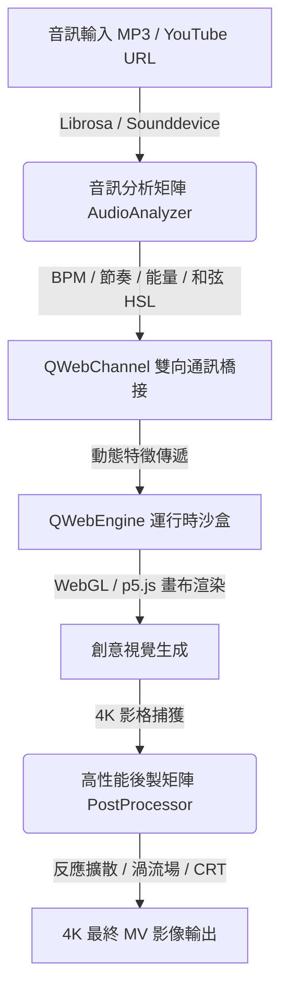

# 4K MV Visual Integration Editor 🎬✨

[](https://github.com/wannaplaymusic/4k-mv-visual-editor)
[](https://python.org)
[](https://www.riverbankcomputing.com/software/pyqt/)
[]()

`4K MV Visual Integration Editor` 是一個專為 4K 音樂錄影帶（Music Video）與即時 VJ 演出設計的**混合型高性能音視互動編輯系統**。

本系統結合了 **PyQt6 桌面端應用程式**與 **前端 WebGL / p5.js 渲染畫布**，透過高速二進位級/JSON 雙向橋接（QWebChannel），將後端提取的高維度即時音訊特徵，動態餵給前端視覺模組；同時利用 **OpenCV** 在後端進行工業級 4K 影格後製處理（包括反應擴散、流體渦流場模擬等），為音樂人、VJ 以及多媒體藝術家提供極致震撼的視覺生成平台。

---

## 🚀 核心架構與功能



### 1. 🎵 智能音訊分析矩陣 (`audio_analyzer.py`)
*   **多頻段特徵提取**：即時分析並提取 `Sub-bass`、`Bass`、`Mid`、`High` 等子頻段的動態能量比率，配合自動增益與平滑濾波器。
*   **即時和弦辨識與色彩映射**：利用 Chroma STFT 計算特徵向量，比對大/小/增/減和弦模板，並基於**五度圈（Circle of Fifths）**將音高關係轉化為對應的 HSL/Hex 顏色，驅動畫布的色彩基調。
*   **自適應風格防護**：自動偵測 BPM 並識別樂曲風格（如 Ambient、Lo-Fi、Techno），動態調整節奏（Beat）觸發的安全冷卻時間（`t_gap`）。

### 2. 🛡️ p5.js / Processing 自動轉譯與防崩潰沙盒 (`batch_importer.py` & `code_injector.py`)
*   **Java PDE 轉譯器**：自動解析 Processing 語法，將其轉譯為相容 p5.js 的標準 ES6 JavaScript 代碼。
*   **運行時錯誤免疫系統 (Immunity Proxy)**：注入 Proxy 與防禦性 Stub，隔離 DOM 的 `.style` / `.position` 拋錯，並對常見缺失的第三方庫（如 `ml5.js` 機器學習、`Tone.js` 音效、`planck.js` 物理引擎）進行安全攔截，確保沙盒安全不紅字。

### 3. 🌀 工業級 VJ 影像後製引擎 (`post_processor.py`)
*   **反應擴散動力學 (Reaction-Diffusion)**：基於 OpenCV ndarray 運算，將上一格畫面進行微幅放大、對比度激化與高動態融合，並配合音樂屬性（大/小調）融入莫蘭迪情緒色調。
*   **流體模擬 (Fluid Simulator)**：基於**旋轉渦流場 (Vortex Field)** 模型，重拍時產生動態渦流中心，使用 `cv2.remap` 進行低延遲、高平滑的流體扭曲特效。
*   **時間卷軸矩陣 (Time-Vessel Matrix)**：維護滾動的音訊特徵緩衝區，根據樂曲種子（Seed）生成招牌特效序列（如 CRT 濾波器、Data-moshing、Slit-scan 等）。

### 4. 🎛️ 現代化 PyQt6 主界面應用 (`main.py`)
*   **16:9 約束容器**：`AspectRatioWidget` 確保視覺畫布在任何視窗比例下都保持完美的 16:9 MV 畫面比。
*   **多線程資源調度**：下載與進度追蹤完全異步化（`QThread`），保證 4K 預覽與錄製時的 UI 高幀率流暢度。

---

## 📂 專案結構說明

```
.
├── main.py                    # 專案主入口，處理 PyQt6 界面與 QWebEngineView 初始化
├── audio_analyzer.py          # 音訊核心，負責 librosa 特徵提取、和弦分析與 BPM 追蹤
├── batch_importer.py          # 批量轉譯引擎，將 Processing PDE 代碼轉譯為安全 p5.js 代碼
├── code_injector.py           # 程式碼編譯、防護 Stub 注入與沙盒預覽管理器
├── post_processor.py          # VJ 特效引擎，處理反應擴散、渦流流體、CRT 噪點等 OpenCV 濾鏡
├── download_all_dependencies.py# 自動化依賴庫下載指令碼
├── requirements.txt           # Python 套件依賴清單
├── Launch.command             # Mac 快捷雙擊啟動腳本
├── custom_visuals/            # 存放預設及使用者自訂的視覺效果模組
└── .agents/                   # 開發輔助 Skills (供 Antigravity AI 助理全域調用)
```

---

## 🛠️ 快速開始

### 1. 安裝系統依賴
本專案的音訊分析與影像處理需要底層函式庫支援。在 Mac 上您可以使用 `Homebrew` 安裝：
```bash
brew install portaudio ffmpeg libsndfile
```

### 2. 配置 Python 虛擬環境
```bash
# 建立虛擬環境
python3 -m venv .venv

# 啟用虛擬環境
source .venv/bin/activate

# 安裝依賴套件
pip install --upgrade pip
pip install -r requirements.txt
```

### 3. 啟動編輯器
您可以直接執行 `main.py` 或在 Finder 中雙擊 `Launch.command`：
```bash
python3 main.py
```

---

## 🤖 關於開發 Skills (`.agents/skills`)
為了讓 **Antigravity AI 助理** 在後續開發中能夠精確理解與延續本專案的設計，我們將核心算法模組封裝進了全域的 Agent Skills。當您在進行功能擴展時，可以直接對 AI 呼叫以下 Skill：
1.  `audio-feature-extraction`：音訊多頻段提取與 HSL 和弦色彩映射。
2.  `p5js-sandbox-patcher`：創意程式碼安全防護與 Java PDE 轉譯。
3.  `vj-post-processing-effects`：OpenCV 反應擴散與流體渦流後製特效。
4.  `pyside-web-bridge`：PyQt6 / QWebChannel 雙向通訊與高流暢度界面架構。
