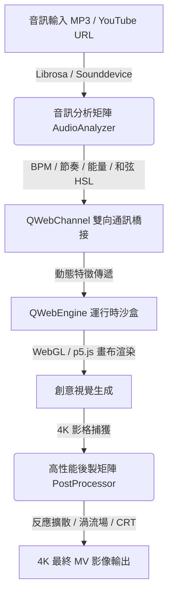
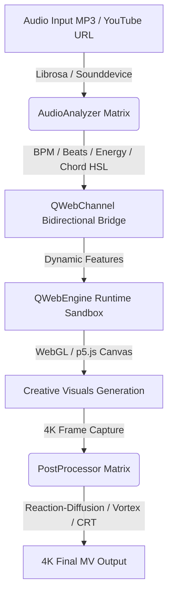

# 4K MV Visual Integration Editor 🎬✨

[](https://github.com/wannaplaymusic/4k-mv-visual-editor)
[](https://python.org)
[](https://www.riverbankcomputing.com/software/pyqt/)
[]()

🌐 **[繁體中文](#-繁體中文) | [English](#-english)**

---

## 🇹🇼 繁體中文

`4K MV Visual Integration Editor` 是一個專為 4K 音樂錄影帶（Music Video）與即時 VJ 演出設計的**混合型高性能音視互動編輯系統**。

本系統結合了 **PyQt6 桌面端應用程式**與 **前端 WebGL / p5.js 渲染畫布**，透過高速二進位級/JSON 雙向橋接（QWebChannel），將後端提取的高維度即時音訊特徵，動態餵給前端視覺模組；同時利用 **OpenCV** 在後端進行工業級 4K 影格後製處理（包括反應擴散、流體渦流場模擬等），為音樂人、VJ 以及多媒體藝術家提供極致震撼的視覺生成平台。

### 🚀 核心架構與功能



*   **🎵 智能音訊分析矩陣 (`audio_analyzer.py`)**：即時分析並提取 `Sub-bass`、`Bass`、`Mid`、`High` 等子頻段的動態能量比率。利用 Chroma STFT 計算特徵向量，比對大/小/增/減和弦模板，並基於**五度圈（Circle of Fifths）**將音高關係轉化為對應的 HSL/Hex 顏色。
*   **🛡️ p5.js / Processing 自動轉譯與防崩潰沙盒 (`batch_importer.py` & `code_injector.py`)**：自動解析 Processing 語法，將其轉譯為標準 ES6 JS 代碼。注入 Proxy 與防禦性 Stub，隔離 DOM 樣式/位置拋錯，安全攔截 `ml5.js`、`Tone.js`、`THREE.Group` 等缺失庫，防止沙盒紅字。
*   **🌀 工業級 VJ 影像後製引擎 (`post_processor.py`)**：基於 OpenCV ndarray 運算，進行無感微幅放大、對比度激化與高動態融合，並配合音樂屬性融入情緒色調。基於**旋轉渦流場 (Vortex Field)** 模型，重拍時產生動態渦流中心，使用 `cv2.remap` 進行低延遲、高平滑的流體扭曲。
*   **🎛️ 現代化 PyQt6 主界面應用 (`main.py`)**：`AspectRatioWidget` 確保視覺畫布在任何視窗比例下都保持完美的 16:9 MV 畫面比。下載與進度追蹤完全異步化（`QThread`），保證 4K 預覽與錄製時的 UI 流暢度。

### 📂 專案結構說明
*   `main.py`：專案主入口，處理 PyQt6 界面與 QWebEngineView 初始化。
*   `audio_analyzer.py`：音訊核心，負責 librosa 特徵提取、和弦分析與 BPM 追蹤。
*   `batch_importer.py`：批量轉譯引擎，將 Processing PDE 代碼轉譯為安全 p5.js 代碼。
*   `code_injector.py`：程式碼編譯、防護 Stub 注入與沙盒預覽管理器。
*   `post_processor.py`：VJ 特效引擎，處理反應擴散、渦流流體、CRT 噪點等 OpenCV 濾鏡。
*   `download_all_dependencies.py`：自動化依賴庫下載指令碼。
*   `.agents/`：開發輔助 Skills（供 Antigravity AI 助理全域調用）。

### 🛠️ 快速開始
1.  **安裝系統依賴**（Mac）：
    ```bash
    brew install portaudio ffmpeg libsndfile
    ```
2.  **配置 Python 虛擬環境**：
    ```bash
    python3 -m venv .venv
    source .venv/bin/activate
    pip install -r requirements.txt
    ```
3.  **啟動編輯器**：
    ```bash
    python3 main.py
    ```

---

## 🇺🇸 English

`4K MV Visual Integration Editor` is a **high-performance hybrid desktop audio-visual editor** designed for 4K Music Video creation and live VJ performances.

It integrates a **PyQt6 desktop interface** with a **WebGL / p5.js rendering canvas**, passing high-dimensional audio features extracted in Python to the frontend via a high-speed bidirectional JSON bridge (`QWebChannel`). Concurrently, it employs **OpenCV** in Python to perform industrial-grade 4K post-processing (e.g., reaction-diffusion feedback, fluid vortex simulations) on rendered frames, providing a state-of-the-art visual generator for musicians, VJs, and multimedia artists.

### 🚀 Core Architecture & Features



*   **🎵 Smart Audio Analysis (`audio_analyzer.py`)**: Performs real-time extraction of spectral energy ratios for `Sub-bass`, `Bass`, `Mid`, and `High` bands. It matches pitch class profiles against major/minor/augmented/diminished chord templates using Chroma STFT and maps the root note to HSL colors using the **Circle of Fifths**.
*   **🛡️ Automated p5.js/Processing Transpiler (`batch_importer.py` & `code_injector.py`)**: Automatically parses Java-style Processing PDE files and transpiles them into standard ES6 p5.js code. It injects defensive JavaScript Proxies and Stubs to immunize the runtime sandbox from DOM styling/positioning errors and missing libraries (such as `ml5.js`, `Tone.js`, and `THREE.Group`).
*   **🌀 Industrial VJ Post-Processing Engine (`post_processor.py`)**: Uses high-performance NumPy operations to apply reaction-diffusion kinetics (micro-scaling, contrast enhancement, and color blending mapped to major/minor keys). It also implements a **Vortex Field** fluid simulator that generates rotational vortices on beats, applying smooth spatial distortions via `cv2.remap`.
*   **🎛️ Modern PyQt6 Desktop Application (`main.py`)**: Features an `AspectRatioWidget` to lock the visual canvas aspect ratio to a clean 16:9 box. Heavy file downloading and audio analysis are fully asynchronous (`QThread`) to guarantee stutter-free 4K previews and recordings.

### 📂 Project Directory Structure
*   `main.py`: Main entry point initializing PyQt6 UI and the QWebEngineView window.
*   `audio_analyzer.py`: Audio analysis module for Librosa feature extraction and chord estimation.
*   `batch_importer.py`: Transpilation engine that refactors Processing PDE scripts to browser-safe p5.js.
*   `code_injector.py`: Code compiler, error shield generator, and preview sandbox controller.
*   `post_processor.py`: VJ post-processing pipeline containing OpenCV feedback and fluid shaders.
*   `download_all_dependencies.py`: Utility script to batch download external libraries.
*   `.agents/`: Developer support Skills (globally accessible by the Antigravity AI agent).

### 🛠️ Getting Started
1.  **Install System Dependencies** (Mac):
    ```bash
    brew install portaudio ffmpeg libsndfile
    ```
2.  **Configure Python Virtual Environment**:
    ```bash
    python3 -m venv .venv
    source .venv/bin/activate
    pip install -r requirements.txt
    ```
3.  **Run the Editor**:
    ```bash
    python3 main.py
    ```

---

### 📅 更新日誌 (Changelog)

#### [v1.1.0] - 2026-07-19
*   **🎨 程序化色彩調色盤生成器**：基於音訊檔名雜湊生成確定性隨機種子，自適應選擇 10 種風格之一（Vaporwave, Cyberpunk, Morandi 等），並透過五度圈進行和弦情緒映射，解決大量歌曲視覺重複問題。
*   **🌀 工業級 VJ 素材過渡效果**：引進 5 種基於 OpenCV/NumPy 的高效率過渡演算法（位移、縮放模糊、亮度擦除、通道故障與滑動推移）。
*   **🎬 情緒自適應導演系統**：整合分鏡段落（Intro, Verse, Chorus, Bridge, Build-up）與音訊能量，自動調配最佳過渡時長與效果。
*   **🛡️ 全域光敏健康防護**：預設並強制啟用光敏感健康保護與防癲癇機制，限制高頻閃爍、劇烈色彩翻轉與全螢幕高光刺激。

#### [v1.1.0] - 2026-07-19 (English)
*   **🎨 Procedural Color Palette Generator**: Dynamically generates unique, deterministic HSL color palettes based on audio filename hash, choosing from 10 distinct themes (Vaporwave, Cyberpunk, Morandi, etc.) to ensure complete visual uniqueness for 3000+ songs.
*   **🌀 Advanced VJ Transitions**: Implements 5 high-performance OpenCV/NumPy transitions (Displacement, Zoom Blur, Luma Wipe, Glitch Channel Split, Slide Push with motion blur).
*   **🎬 Emotional Adaptive Director System**: Automatically maps transition types and durations to song structure sections (Intro, Verse, Chorus, Bridge, Build-up) and beat energy.
*   **🛡️ Mandatory Photosensitive Safety**: Hardcoded global photosensitive safety filters to cap strobe, flash, and RGB splitting to protect viewers.
